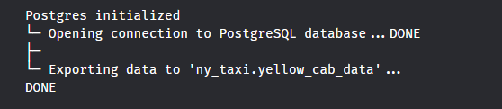

# Week1 Set up the environment

## postgres docker
```python
docker run -it \
-e POSTGRES_USER="labber" \
-e POSTGRES_PASSWORD="labber" \
-e POSTGRES_DB="ny_taxi" \
-v $(pwd)/ny_taxi_postgres_data:/var/lib/postgresql/data \
-p 5432:5432 \
--network=pg-network \
--name pg-database \
postgres:13
```

## pgcli access to database
```python
pgcli -h localhost -p 5432 -u labber -d ny_taxi
```

## inject data (upload_data.ipynb)
- can create a ipynb in vscode
- or use jupyter notebook in the browser
 - if cannot open jupyter notebook in the browser, try the code below
 `sudo update-alternatives --install /usr/bin/x-www-browser x-www-browser /opt/google/chrome/google-chrome 200`
- follow the steps in upload_data.ipynb

## pgadmin
```python
docker run -it \
-e PGADMIN_DEFAULT_EMAIL="admin@admin.com" \
-e PGADMIN_DEFAULT_PASSWORD="labber" \
-p 8080:80 \
--network=pg-network \
--name pgadmin \
dpage/pgadmin4
```

## create pg network to connect pgadmin and postgres
```python
docker network create pg-network
```
**In the pgAdmin interface**
- create a new server
- input the name in general
- Connection:
    - host name: pg-database
    - username: labber
    - password: labber

- interface
    - Database
        - ny_taxi
            - schemas
                - tables
                    - yellow_taxi_data

- tools -> query tool -> write your own query

## conver jupyter notebook to script
```python
jupyter nbconvert --to=script upload_data.ipynb
```

## Ingest data with the script
```python
url="https://github.com/DataTalksClub/nyc-tlc-data/releases/download/yellow/yellow_tripdata_2021-01.csv.gz"
python3 ingest_data.py \
    --user=labber \
    --password=labber \
    --host=localhost \
    --port=5432 \
    --database=ny_taxi \
    --table=yellow_taxi_trips \
    --url=${url}
```
## Dockerfile
```python
FROM python:3.10

RUN apt-get install wget
RUN pip install pandas sqlalchemy pgcli psycopg2-binary

WORKDIR /app
COPY ingest_data.py ingest_data.py

ENTRYPOINT [ "python3", "ingest_data.py" ]
```
```python
docker build -t taxi_ingest:v001 .

# user ifconfig to find the IP address -- under "eth0"
# can run python -m http:server to make the ingestion faster
python3 -m http.server 8000

url="http://172.23.55.174:8000/yellow_tripdata_2021-01.csv.gz"
docker run -it \
    --network=pg-network \
    taxi_ingest:v001 \
        --user=labber \
        --password=labber \
        --host=pg-database \
        --port=5432 \
        --database=ny_taxi \
        --table=yellow_taxi_trips \
        --url=${url}
```

## Docker-compose to build connection and inject data
- intall
```python
# Download the Docker Compose binary
sudo curl -L "https://github.com/docker/compose/releases/download/v2.24.0/docker-compose-$(uname -s)-$(uname -m)" -o /usr/local/bin/docker-compose

# Apply executable permissions to the binary
sudo chmod +x /usr/local/bin/docker-compose

# Verify the installation
docker-compose --version
```
- yaml file
```python
services:
  pgdatabase:
    image: postgres:13
    environment:
      - POSTGRES_USER=labber
      - POSTGRES_PASSWORD=labber
      - POSTGRES_DB=ny_taxi
    ports:
      - "5432:5432"
    volumes:
      - ./ny_taxi_postgres_data:/var/lib/postgresql/data:rw
    networks:
      - pg-network
  pgadmin:
    image: dpage/pgadmin4
    environment:
      - PGADMIN_DEFAULT_EMAIL=admin@admin.com
      - PGADMIN_DEFAULT_PASSWORD=labber
    ports:
      - "8080:80"
    networks:
      - pg-network
networks:
  pg-network:
    name: pg-network
    external: true
```
- run yaml
```python
docker-compose up -d
```
- stop yaml
```python
docker-compose down
```

## Google Cloud set up
- Go to .ssh folder -> `ssh-keygen -t rsa -f your-file-name -C cloud-username -b 2048`
- you can leave the password as empty
- you will have a private and public key in .ssh folder
- put the public key (xx.pub) to google cloud
- Compute Engine -> settings -> metadata -> SSH KEYS -> ADD -> (in terminal) cat xx.pub -> copy the info and paste the key in google cloud -> save
- VM instances -> create a new instance -> pick your configuration
- remember the External IP
- `ssh -i ~/.ssh/keyname username@External IP`
- use `htop` to check the machines; `F10` exit
- `gcloud --version` check google cloud info
- we can create a config file to login gl
  - config file
    ```python
    Host vm-instance-name
      HostName your-gl-external-ip (**need to update it every time you restart the instance because it changes**)
      User gl-username
      IdentityFile ~/.ssh/key-name
    ```

## install ananconda
- download from https://www.anaconda.com/download -> choose your own installer -> right click, copy link
- for Linux `wget https://repo.anaconda.com/archive/Anaconda3-2023.09-0-Linux-x86_64.sh`
- press "enter" until it asks you to accept the license -> "yes" -> "yes" initialize anaconda
- `ssh de-zoomcamp` to login
- `ctrl+d` to logout

## install docker
```python
sudo apt-get update
sudo apt-get install docker.io
```

## connect to remote-shh
- vscode install Remote-SSH extension
- F1 KEY -> Add new host -> de-zoomcamp (you might need to adjust your config file if there is a connection issue)
- every time you restart the server, the external IP may change

## docker without sudo
https://github.com/sindresorhus/guides/blob/main/docker-without-sudo.md
- Add the docker group if it doesn't already exist `sudo groupadd docker`
- Add the connected user $USER to the docker group `sudo gpasswd -a $USER docker`
- Restart the docker daemon `sudo service docker restart`
- Test whether it works -> `docker run hello-world`

## docker-compose in gc
https://github.com/docker/compose/releases/download/v2.24.1/docker-compose-linux-x86_64
- make a folder bin
- in bin folder install docker-compose
- `wget https://github.com/docker/compose/releases/download/v2.24.1/docker-compose-linux-x86_64`
- make it executable `chmod +x docker-compose`
- make it visible to any directories `nano .bashrc`
- at the end of the document add `export PATH="${HOME}/bin:${PATH}"`
- `ctrl + o` to save the file
- `ctrl + x` to exit
- download `git clone https://github.com/sarah-zhan/dtc-de.git`
- `docker network create pg-network` (optional, if the yaml returns error)
- run yaml file `docker-compose up -d`

## forward the port to local
- show vscode terminal -> "PORTS" -> forward Port
- access database `pgcli -h localhost -u labber -d ny_taxi`
- add port 8080 -> localhost:8080 -> login pgadmin

## run upload_data
- jupyter notebook
- copy the link localhost:8888..... in the browser (can also do it in vscode)
- test to insert 100 rows of data
- try whether it works `pgcli -h localhost -u labber -d ny_taxi`
- `dt`

## download terraform
- download `wget https://releases.hashicorp.com/terraform/1.7.0/terraform_1.7.0_linux_amd64.zip`
- `unzip terraform_1.7.0_linux_amd64.zip`
- `rm terraform_1.7.0_linux_amd64.zip`

## Configure Terraform
- main.tf
```python
terraform {
  required_providers {
    google = {
      source = "hashicorp/google"
      version = "5.12.0"
    }
  }
}

provider "google" {
  project     = "my-project-id"
  region      = "us-central1"
}

resource "google_storage_bucket" "zoomcamp_bucket" {
  name          = "terraform-bucket-01" # this name must be globaly unique
  location      = "US"
  force_destroy = true

  lifecycle_rule {
    condition {
      age = 1
    }
    action {
      type = "AbortIncompleteMultipartUpload"
    }
  }
}

resource "google_bigquery_dataset" "demo" {
  dataset_id                      = "demo_dataset"
  default_partition_expiration_ms = 2592000000  # 30 days
  default_table_expiration_ms     = 31536000000 # 365 days
  description                     = "demo dataset"
  location                        = "US"
  max_time_travel_hours           = 96 # 4 days

}
```

## Terraform
- sudo snap install terraform --classic
- terraform init (after terraform, provider block in main.tf)
- terraform plan (after resource block in main.tf)
- terraform apply
- terraform destroy (delete resources)

## add variables.tf
for example
```python
variable "dataset_name" {
  type = string
  default = "demo_dataset"
  description = "value of the demo dataset"
}
```
**make sure to update .gitignore file to include terreform info**

## add credential - transfer files
- `sudo apt-get install openssh-server`
- in ssh__config add `Subsystem sftp internal-sftp`
- generate ssh key `ssh-keygen -t rsa -b 2048 -f ~/.ssh/id_rsa -C "your_email@example.com"`
- add the key to gl `gcloud compute instances add-metadata INSTANCE_NAME --metadata ssh-keys="USERNAME:$(cat ~/.ssh/id_rsa.pub)"`
- export GOOGLE_APPLICATION_CREDENTIALS=/path/to/your/key-file.json
- Create a Service Account in the console (IAM)
- Create and Download JSON Key File: "IAM & Admin" > "Service accounts," select your service account, and click on "Create Key." Choose JSON as the key type and download the key file.
- Set the Environment Variable: `export GOOGLE_APPLICATION_CREDENTIALS=/path/to/your/key-file.json`
- Verify the Configuration: `echo $GOOGLE_APPLICATION_CREDENTIALS`
- Use the gcloud SDK with the Service Account: `gcloud auth activate-service-account --key-file=$GOOGLE_APPLICATION_CREDENTIALS`
- `mkdir -p ~/.ssh` (optional)
- `chmod 700 ~/.ssh` (optional)
- `touch ~/.ssh/authorized_keys`
- `chmod 600 ~/.ssh/authorized_keys`
- `echo "your_public_key" >> ~/.ssh/authorized_keys`
- `sftp username@external_ip` / `sftp instance_name` SFTP (Secure File Transfer Protocol) is a secure alternative to FTP for transferring files.
- create a folder -> cd to that folder
- send the file to that folder `put local_file.txt`
- download fild `get remote_file.txt`
- `exit` for exit

## Google Cloud
- Set the Environment Variable: `export GOOGLE_APPLICATION_CREDENTIALS=/path/to/your/key-file.json`
- Use the gcloud SDK with the Service Account: `gcloud auth activate-service-account --key-file=$GOOGLE_APPLICATION_CREDENTIALS`
- remove credential `unset GOOGLE_APPLICATION_CREDENTIALS`
- stop the instance `sudo shutdown`


# Week2 Workflow Orchestration
## use Mage

### Install docker
```python
#clone the repo
git clone https://github.com/mage-ai/mage-zoomcamp.git mage-zoomcamp

# navigate to folder
cd mage-zoomcamp

# check the files inside folder
ls -la

# change the name
cp dev.env .env

# build the container
docker compose build

# update the docker
docker pull mageai/mageai:latest

# start the container
docker compose up

# navigate to http://localhost:6789 in your browser!


```

- update io_config.yaml in mage
  add the code below
  ```python
  dev:
    POSTGRES_CONNECT_TIMEOUT: 10
    POSTGRES_DBNAME: "{{env_var('POSTGRES_DBNAME')}}"
    POSTGRES_SCHEMA: "{{env_var('POSTGRES_SCHEMA')}}"
    POSTGRES_USER: "{{env_var('POSTGRES_USER')}}"
    POSTGRES_PASSWORD: "{{env_var('POSTGRES_PASSWORD')}}"
    POSTGRES_HOST: "{{env_var('POSTGRES_HOST')}}"
    POSTGRES_PORT: "{{env_var('POSTGRES_PORT')}}"
  ```
- Edit pipeline -> new -> standard (batch) -> Edit -> Pipeline settings -> edit the pipeline name
- Edit pipeline -> Data loader -> SQL -> Name(edit it) -> save
- Connection (PostgreSQL) -> Profile (dev) -> choose "Use raw SQL" -> run block


### use api to upload data
- Edit pipeline -> Python -> API -> Name(edit it) -> save
- add url in the template url = 'https://github.com/DataTalksClub/nyc-tlc-data/releases/download/yellow/yellow_tripdata_2021-01.csv.gz'
- declare deta types
```python
    # declear data type
    taxi_dtypes = {
        'VendorID': pd.Int64Dtype(),
        'passenger_count': pd.Int64Dtype(),
        'trip_distance': float,
        'RatecodeID': pd.Int64Dtype(),
        'store_and_fwd_flag': str,
        'PULocationID': pd.Int64Dtype(),
        'DOLocationID': pd.Int64Dtype(),
        'payment_type': pd.Int64Dtype(),
        'fare_amount': float,
        'extra': float,
        'mta_tax': float,
        'tip_amount': float,
        'tolls_amount': float,
        'improvement_surcharge': float,
        'total_amount': float,
        'congestion_surcharge': float
    }

    # timestamp data
    parse_dates = ['tpep_pickup_datetime', 'tpep_dropoff_datetime']


    return pd.read_csv(url, sep=",", compression="gzip", dtype=taxi_dtypes, parse_dates=parse_dates)
```


- transform taxi data
  - TRANSFORMER -> Python -> Generic
  - clean the data that with passenger count is 0
```python
  @transformer
  def transform(data, *args, **kwargs):
      print(f"Preprocessing: rows with zero passengers: {data['passenger_count'].isin([0]).sum()}")

      return data[data['passenger_count'] > 0]
```
  - assertion test
```python
  @test
  def test_output(output, *args) -> None:
      assert output['passenger_count'].isin([0]).sum() == 0, 'There are rides with 0 passengers'
```


- export data
  - Data exporter -> Python -> PostgreSQL
  - update the schema name, table name, config_profile


- quick test
  - Data loader -> SQL


### connect to Google Cloud
  - create a bucket
  - create a service account -> generate a key
  - move the json file in mage_zoomcamp folder
  - use the path method to authorize: GOOGLE_SERVICE_ACC_KEY_FILEPATH: "/home/src/your_file_name.json" (remember to remove google key block)
  - use the test_config -> connection (BigQuery) -> Profile (Default) -> run for the test
  
  - use the example_pipeline -> run the code and generate a csv file
  - upload that file to the bucket
  - back to test_config
  - Data loader -> Python - GoogleCloud Storage
  - update
```python
    bucket_name = 'your_bucket_name'
    object_key = 'titanic_clean.csv'
```


### put them together
- create a new pipeline
- Data loader: copy (drag and drop) the load_api_data
- Transformer: copy (drag and drop) the transform_taxi_data
- connect the loader and transformer

- Data exporter: update code
```python
    bucket_name = 'your_bucket_name'
    object_key = 'nyc_taxi_data.parquet'
```
- taxi data is uploaded


**upload data in partitions**
- Data exporter - Python - Generic
- connect transformer to parquest directly

```python
import pyarrow as pa
import pyarrow.parquet as pq
import os

if 'data_exporter' not in globals():
    from mage_ai.data_preparation.decorators import data_exporter

os.environ['GOOGLE_APPLICATION_CREDENTIALS'] = '/home/src/data-engineering-409902-ab07d6523f32.json'

bucket_name = 'zoomcamp-mage-bucket'
project_id = 'data-engineering-409902'

table_name = 'nyc_taxi_data'

root_path = f'{bucket_name}/{table_name}'

@data_exporter
def export_data(data, *args, **kwargs):
    data['tpep_pickup_date'] = data['tpep_pickup_datetime'].dt.date

    table = pa.Table.from_pandas(data)

    gcs = pa.fs.GcsFileSystem()

    pq.write_to_dataset(
        table,
        root_path=root_path,
        partition_cols=['tpep_pickup_date'],
        filesystem=gcs
    )
```

### upload data from gsc to bigquery
- create a pipeline
- Data loader - Python - GoogleCloud Storage
- update name
```python
    bucket_name = 'your_bucket_name'
    object_key = 'nyc_taxi_data.parquet'
```
- Transformer (standardize column name)
```python
@transformer
def transform(data, *args, **kwargs):
    data.columns = (data.columns
                    .str.replace(' ', '_')
                    .str.lower()
    )
    return data
```
- Data exporter - SQL
- connection(BigQuery)/Profile(default)/name schema, table


### set up schedule to upload data


### load data to gcp parameterize
- copy load_to_gcp pipeline
- update data exporter
- add execution date
```python
    now = kwargs.get('execution_date')
    now_fpath = now.strftime('%Y/%m/%d')
    object_key = f'{now_fpath}/nyc_taxi_data.parquet'
```

### backfills data


### Deployment
- check google cloud credential `gcloud auth list` `gcloud storage ls`
- download templates `git clone https://github.com/mage-ai/mage-ai-terraform-templates.git`
- check `cd mage-ai-terraform-temp` `ls -la`
- we use gcp `cd gcp`


# Week3 BigQuery
https://github.com/DataTalksClub/data-engineering-zoomcamp/tree/main/03-data-warehouse

# Week4 Analysis
- initial set up to inject all data: https://www.youtube.com/watch?v=Mork172sK_c&list=PLaNLNpjZpzwgneiI-Gl8df8GCsPYp_6Bs
- set up dbt: https://www.youtube.com/watch?v=J0XCDyKiU64&list=PL3MmuxUbc_hJed7dXYoJw8DoCuVHhGEQb&index=42
- make sure to create a new branch, the default branch is read only
- under models folder, create schema.yml
```python
version: 2

sources:
  - name: staging
    database: data-engineering-409902
    schema: trips_data_all

    tables:
      - name: green_tripdata
      - name: yellow_tripdata
```

- click "Generate model" in schema.yml file
- macros folder -> create file ->

```c
{#
    This macro returns the description of the payment_type
#}



    case {{ dbt.safe_cast("payment_type", api.Column.translate_type("integer"))}}
        when 1 then 'Credit card'
        when 2 then 'Cash'
        when 3 then 'No charge'
        when 4 then 'Dispute'
        when 5 then 'Unknown'
        when 6 then 'Voided trip'
        else 'EMPTY'
    end


```
  - in the stg_green_tripdata.sql, add `{{get_payment_type_description('payment_type')}} as payment_type_description`, then compile to check the result
- dbt_util
  - create packages.yml
```htm
    packages:
    - package: dbt-labs/dbt_utils
      version: 1.1.1
```
  - `dbt deps` to install
  - in the stg_green_tripdata.sql, add in 1st line in the `select` statement `{{ dbt_utils.generate_surrogate_key(['vendor_id', 'pickup_datetime']) }} as tripid,`
  - compile to check the result
- check run history under target/compiled folder
- repeat the same steps for yellow cab data
- in seeds folder -> create taxi_zone_lookup.csv -> copy/paste the taxi_zone_lookup.csv(raw) -> build -> upload to GC
- fact_trips.sql (be careful of the column names) details in file
- choose `build + model +(Up/downstream)`
- production: `dbt build --select +fact_trips+ --vars '{'is_test_run': 'false'}'`
- install dbt-labs/codegen
- use this code to generate model information
```python

{{ codegen.generate_model_yaml(
    model_names = models_to_generate
) }}
```
- add test to the schema
-
```python
tests:
          - unique:
              serverity: warn
          - not_null:
              serverity: warn
tests:
          - relationships:
              field: locationdid
              to: ref('taxi_zone_lookup')
              serverity: warn
tests:
          - accepted_values:
              values: {{var ('payment_type_values')}}
              serverity: warn
              quote: false
```
- add schema.yml to core folder (same steps as another schema file)
- `dbt docs generate`
- 
  

- create a new production environment
- create a new job -> deploy -> fill in the info


# Week5 Spark
## Set up
- downloand java
`wget https://download.java.net/java/GA/jdk11/9/GPL/openjdk-11.0.2_linux-x64_bin.tar.gz`
`tar xzfv openjdk-11.0.2_linux-x64_bin.tar.gz`
`export JAVA_HOME="${HOME}/spark/jdk-11.0.2"`
`export PATH="${JAVA_HOME}/bin:${PATH}"`
- download pyspark
`wget https://dlcdn.apache.org/spark/spark-3.5.1/spark-3.5.1-bin-hadoop3.tgz`
`tar xzfv spark-3.5.1-bin-hadoop3.tgz`
`export SPARK_HOME="${HOME}/spark/spark-3.5.1-bin-hadoop3"`
`export PATH="${SPARK_HOME}/bin:${PATH}"`
- add these to .bashrc
`nano .bashrc`
`export JAVA_HOME="${HOME}/spark/jdk-11.0.2"`
`export PATH="${JAVA_HOME}/bin:${PATH}"`
`export SPARK_HOME="${HOME}/spark/spark-3.5.1-bin-hadoop3"`
`export PATH="${SPARK_HOME}/bin:${PATH}"`
- ctrl o to save, ctrl x to exit
- terminal
`export PYTHONPATH="${SPARK_HOME}/python/:$PYTHONPATH"`
`export PYTHONPATH="${SPARK_HOME}/python/lib/py4j-0.10.9.7-src.zip:$PYTHONPATH"` **make sure to match the py4j-xxxx name in the folder**
- terminal PORTS -> open new port 8080
- start notebook `jupyter notebook`
  - choose the link and open the the notebook in the browser
  - create a file for testing
```python
  import pyspark
  pyspark.__version__
  pyspark.__file__
```
- start a spark instance
```python
from pyspark.sql import SparkSession

spark = SparkSession.builder \
        .master("local[*]") \
        .appName("test") \
        .getOrCreate()
```
- download the data
`!wget https://s3.amazonaws.com/nyc-tlc/misc/taxi+_zone_lookup.csv`
- read file
```python
df = spark.read \
    .option('header', 'true') \
    .csv('taxi+_zone_lookup.csv')
```
- convert to parquet
```python
df.write.parquet('zones')
```
- terminal -> PORTS - open a new port 4040
- go to `localhost:4040` to check all the spark jobs we just did


## use pyspark
follow `pyspark.ipynb`

## download data
- create download_data.sh
- make it executible `chmod +x download_data.sh`
- run it `./download_data.sh yellow 2021` # change "yellow" "2021" to download different data
- data have not git to remote due to large files
- `export PYTHONPATH="${SPARK_HOME}/python/:$PYTHONPATH"`
  `export PYTHONPATH="${SPARK_HOME}/python/lib/py4j-0.10.9.7-src.zip:$PYTHONPATH"`
  `jupyter notebook`

## practise the spark sql/groupby
`WEEK5-PYSPARK/groupby_join.ipynb`, `WEEK5-PYSPARK/groupby_join.ipynb`

## upload data to google cloud
`gsutil -m cp -r data/green/ gs://zoomcamp-mage-bucket/pq/green`
`gsutil -m cp -r data/yellow/ gs://zoomcamp-mage-bucket/pq/yellow`

## download the connector Hadoop
`gsutil cp gs://hadoop-lib/gcs/gcs-connector-hadoop3-2.2.5.jar gcs-connector-hadoop3-2.2.5.jar`

## set up
spark_gc.ipynb
```python
import pyspark
from pyspark.sql import SparkSession
from pyspark.conf import SparkConf
from pyspark.context import SparkContext

credentials_location = "/home/labber/dtc-de/mage-zoomcamp/data-engineering-409902-0ed8148f1650.json"

conf = SparkConf() \
    .setMaster('local[*]') \
    .setAppName('test') \
    .set("spark.jars", "./lib/gcs-connector-hadoop3-2.2.5.jar") \
    .set("spark.hadoop.google.cloud.auth.service.account.enable", "true") \
    .set("spark.hadoop.google.cloud.auth.service.account.json.keyfile", credentials_location)

sc = SparkContext(conf=conf)

hadoop_conf = sc._jsc.hadoopConfiguration()

hadoop_conf.set("fs.AbstractFileSystem.gs.impl",  "com.google.cloud.hadoop.fs.gcs.GoogleHadoopFS")
hadoop_conf.set("fs.gs.impl", "com.google.cloud.hadoop.fs.gcs.GoogleHadoopFileSystem")
hadoop_conf.set("fs.gs.auth.service.account.json.keyfile", credentials_location)
hadoop_conf.set("fs.gs.auth.service.account.enable", "true")

spark = SparkSession.builder \
    .config(conf=sc.getConf()) \
    .getOrCreate()

df_green = spark.read.parquet("gs://zoomcamp-mage-bucket/pq/green/*")

df_green.show(5)
```
