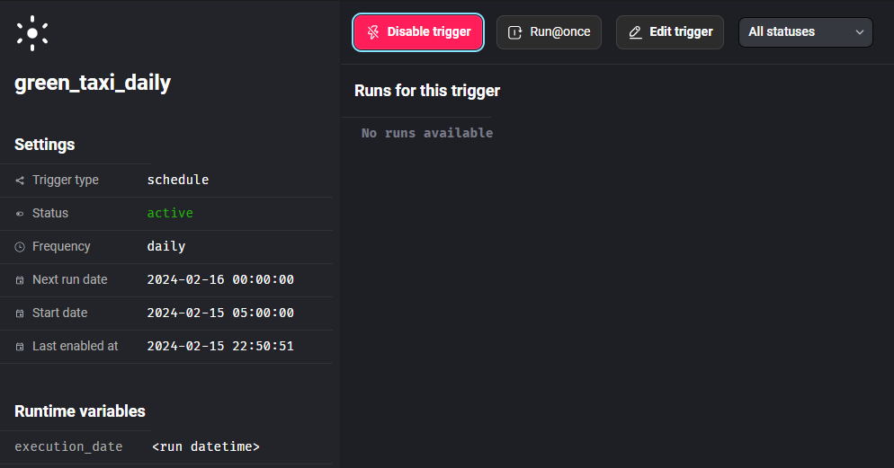

## WEEK 2 Assignment

The goal will be to construct an ETL pipeline that loads the data, performs some transformations, and writes the data to a database (and Google Cloud!).

### Create a new pipeline, call it green_taxi_etl
- Add a data loader block and use Pandas to read data for the final quarter of 2020 (months 10, 11, 12).
- You can use the same datatypes and date parsing methods shown in the course.
- BONUS: load the final three months using a for loop and pd.concat

```python
# DATA LOADER
import io
import pandas as pd
import requests
if 'data_loader' not in globals():
    from mage_ai.data_preparation.decorators import data_loader
if 'test' not in globals():
    from mage_ai.data_preparation.decorators import test

urls = ['https://github.com/DataTalksClub/nyc-tlc-data/releases/download/green/green_tripdata_2020-10.csv.gz', 'https://github.com/DataTalksClub/nyc-tlc-data/releases/download/green/green_tripdata_2020-11.csv.gz', 'https://github.com/DataTalksClub/nyc-tlc-data/releases/download/green/green_tripdata_2020-12.csv.gz']
data_all = pd.DataFrame()


@data_loader
def load_data_from_api(*args, **kwargs):

    # declear data type
    taxi_dtypes = {
        'VendorID': pd.Int64Dtype(),
        'passenger_count': pd.Int64Dtype(),
        'trip_distance': float,
        'RatecodeID': pd.Int64Dtype(),
        'store_and_fwd_flag': str,
        'PULocationID': pd.Int64Dtype(),
        'DOLocationID': pd.Int64Dtype(),
        'payment_type': pd.Int64Dtype(),
        'fare_amount': float,
        'extra': float,
        'mta_tax': float,
        'tip_amount': float,
        'tolls_amount': float,
        'improvement_surcharge': float,
        'total_amount': float,
        'congestion_surcharge': float
    }

    # timestamp data
    parse_dates = ['lpep_pickup_datetime', 'lpep_dropoff_datetime']

    dataframes = []

    for url in urls:
        data = pd.read_csv(url, sep=",", compression="gzip", dtype=taxi_dtypes, parse_dates=parse_dates)
        dataframes.append(data)

    data_all = pd.concat(dataframes)

    return data_all


@test
def test_output(output, *args) -> None:
    """
    Template code for testing the output of the block.
    """
    assert output is not None, 'The output is undefined'


```

### Add a transformer block and perform the following:
- Remove rows where the passenger count is equal to 0 and the trip distance is equal to zero.
- Create a new column lpep_pickup_date by converting lpep_pickup_datetime to a date.
- Rename columns in Camel Case to Snake Case, e.g. VendorID to vendor_id.
- Add three assertions:
vendor_id is one of the existing values in the column (currently)
passenger_count is greater than 0
trip_distance is greater than 0

```python
# TRANSFORMER
import pandas as pd

if 'transformer' not in globals():
    from mage_ai.data_preparation.decorators import transformer
if 'test' not in globals():
    from mage_ai.data_preparation.decorators import test

# Function to convert Camel Case to Snake Case
def camel_to_snake(name):
    import re
    s1 = re.sub('(.)([A-Z][a-z]+)', r'\1_\2', name)
    return re.sub('([a-z0-9])([A-Z])', r'\1_\2', s1).lower()

@transformer
def transform(data, *args, **kwargs):
    data = data[data['passenger_count'] > 0]
    data = data[data['trip_distance'] > 0]
    data['lpep_pickup_date'] = data['lpep_pickup_datetime'].dt.date

    # Rename columns
    data.columns = data.columns.map(lambda x: camel_to_snake(x))

    return data


@test
def test_output(output, *args) -> None:
    assert output['passenger_count'].isin([0]).sum() == 0, 'There are rides with 0 passengers'
    assert output['trip_distance'].isin([0]).sum() == 0, 'There are rides with 0 distance'

    existing_vendor_ids = output['vendor_id'].unique()
    test_vendor_id = 1
    assert test_vendor_id in existing_vendor_ids, 'vendor_id is not one of the existing values in the column'

```

## Using a Postgres data exporter (SQL or Python), write the dataset to a table called green_taxi in a schema mage. Replace the table if it already exists.
Write your data as Parquet files to a bucket in GCP, partioned by lpep_pickup_date. Use the pyarrow library!
Schedule your pipeline to run daily at 5AM UTC.

```python
# DATA EXPORTER
import pyarrow as pa
import pyarrow.parquet as pq
import os

if 'data_exporter' not in globals():
    from mage_ai.data_preparation.decorators import data_exporter

os.environ['GOOGLE_APPLICATION_CREDENTIALS'] = '/home/src/data-engineering-409902-0ed8148f1650.json'

bucket_name = 'zoomcamp-mage-bucket'
project_id = 'data-engineering-409902'

table_name = 'nyc_green_taxi_data'

root_path = f'{bucket_name}/{table_name}'

@data_exporter
def export_data(data, *args, **kwargs):
    data['lpep_pickup_date'] = data['lpep_pickup_datetime'].dt.date

    table = pa.Table.from_pandas(data)

    gcs = pa.fs.GcsFileSystem()

    pq.write_to_dataset(
        table,
        root_path=root_path,
        partition_cols=['lpep_pickup_date'],
        filesystem=gcs
    )
```




### Question 1. Data Loading
Once the dataset is loaded, what's the shape of the data?

- **266,855 rows x 20 columns**
- 544,898 rows x 18 columns
- 544,898 rows x 20 columns
- 133,744 rows x 20 columns

### Question 2. Data Transformation
Upon filtering the dataset where the passenger count is greater than 0 and the trip distance is greater than zero, how many rows are left?

- 544,897 rows
- 266,855 rows
- **139,370 rows**
- 266,856 rows

### Question 3. Data Transformation
Which of the following creates a new column lpep_pickup_date by converting lpep_pickup_datetime to a date?

- data = data['lpep_pickup_datetime'].date
- data('lpep_pickup_date') = data['lpep_pickup_datetime'].date
- **data['lpep_pickup_date'] = data['lpep_pickup_datetime'].dt.date**
- data['lpep_pickup_date'] = data['lpep_pickup_datetime'].dt().date()

### Question 4. Data Transformation
What are the existing values of VendorID in the dataset?

- 1, 2, or 3
- **1 or 2**
- 1, 2, 3, 4
- 1

### Question 5. Data Transformation
How many columns need to be renamed to snake case?

- 3
- 6
- 2
- **4**

### Question 6. Data Exporting
Once exported, how many partitions (folders) are present in Google Cloud?

- **96**
- 56
- 67
- 108